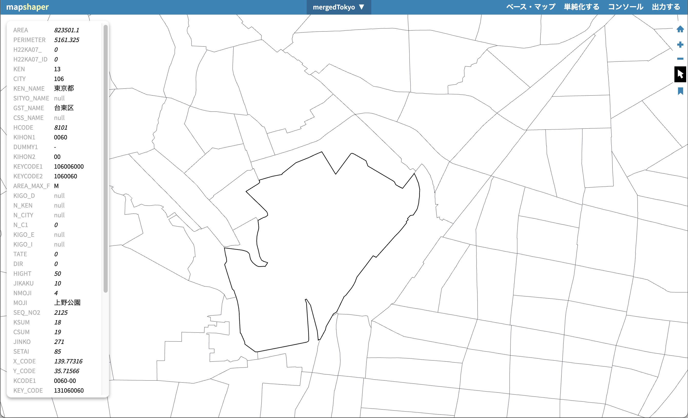
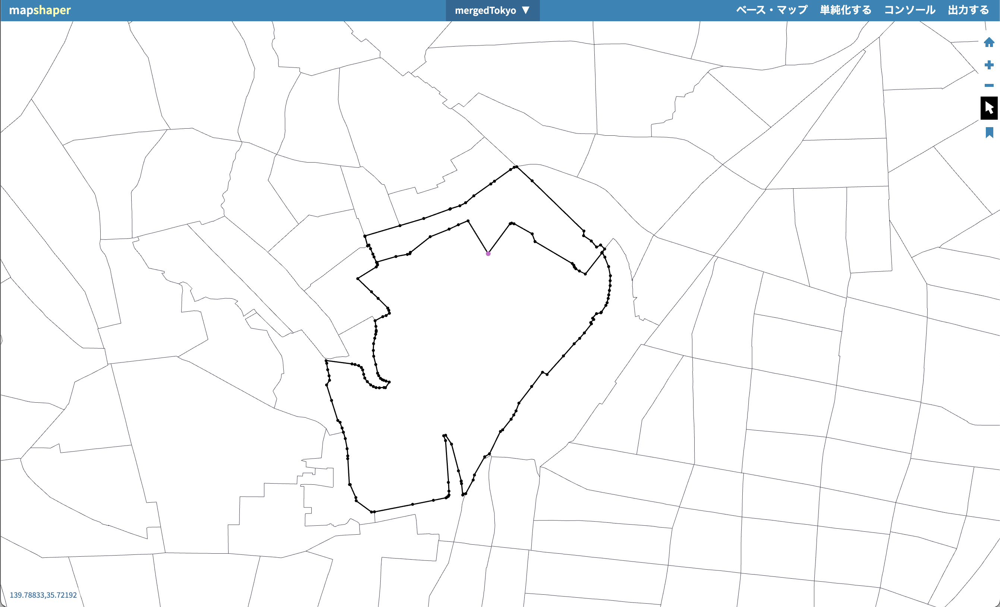
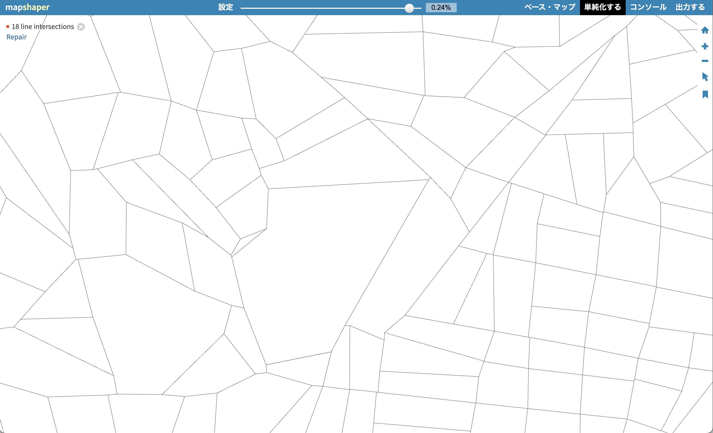




## どんなツールか？

地理空間ベクターデータ（GIS）の編集・変換・簡略化を行う Web ベース・ツールです。地図データを読み込み、形状の単純化・属性編集・形式変換などの操作を直感的に実行できます。GIS ソフトに頼らずにブラウザ上で加工できるのが特徴です。 

## 機能

	•	地理データの読み込み・表示：Shapefile、GeoJSON、TopoJSON などのベクターデータをインポートして表示。 
	•	形状の簡略化（simplification）：ポリゴン/ラインの頂点を減らしてファイルサイズを縮小。トポロジーを保ったまま処理可能。 
	•	属性データ編集：属性テーブルの内容を修正・結合（join**）したり、不要なフィールドを削除。 
	•	変換・出力：複数形式（Shapefile、GeoJSON、TopoJSON、CSV、TSV、SVG など）への変換・書き出し。 
	•	クリッピング／分解：データの切り抜き、結合・分割、ドロップなどの GIS 加工。 

⸻

## 使い方

- 1. データを読み込み・表示...インポートされた地理データがマップビューに表示され、属性や形状を確認。 
- 2. 編集・処理
    - 簡略化：頂点数の削減やトポロジー保持のためのツールを実行。
    - 属性編集：フィールドの追加・削除・結合などを実施。
    - 結合・クリップ：複数データの結合や指定領域での切り抜き。 
- 3. 出力...Export（エクスポート）メニューから目的の形式で保存・ダウンロード。 

## データ形式

- Mapshaper は以下の 主要な GIS ベクターデータ形式 を入出力で扱います：
- Shapefile（ESRI の標準 GIS 形式；.shp/.dbf/.shx などのセット） 
- GeoJSON（JSON ベースの地理情報フォーマット） 
- TopoJSON（GeoJSON のトポロジー圧縮形式） 
- CSV / TSV（座標や属性を含む表形式データとして） 
- SVG（地理形状のベクター画像としての出力例） 

