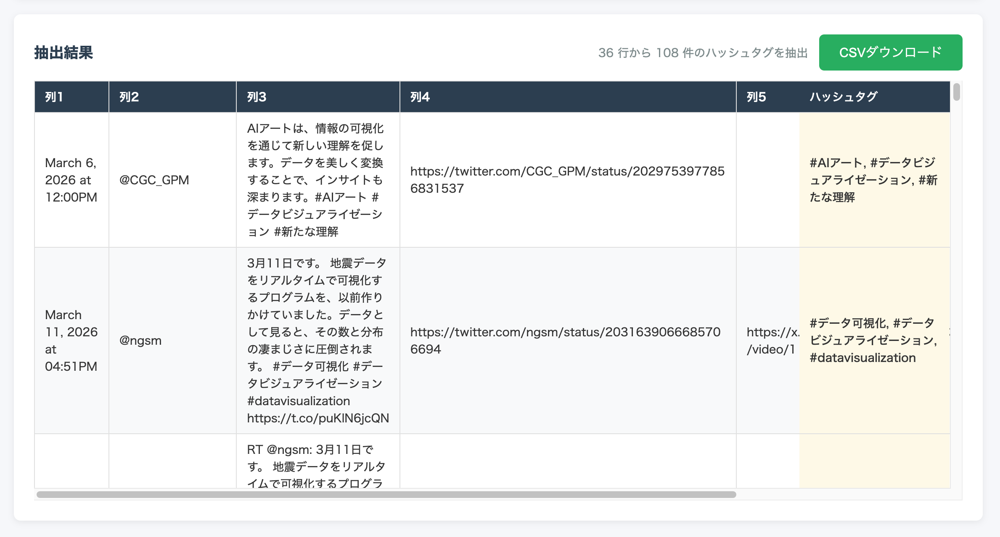




## What is this tool?

A browser-based tool that uses regular expressions to batch-extract hashtags, mentions, URLs, email addresses, and phone numbers from text in CSV/TSV tabular data. All data is processed in your browser and never sent to a server.

## Features

- **5 entity types**: Hashtags (#), mentions (@), URLs, email addresses, phone numbers
- **CSV/TSV support**: Load data via file upload or paste into the text area
- **Column selection**: Choose the target column with sample values displayed
- **Preview**: Review loaded data before extraction
- **CSV export**: Download results as CSV with extracted columns appended to the original data (UTF-8 with BOM)
- **Japanese/English support**: Auto-switches based on browser language; manual switching also available

## How to use

1. **Input data** — Drag & drop a CSV file, or paste CSV/TSV data into the text area
2. **Preview** — Check the number of columns and rows (first 100 rows displayed)
3. **Configure & extract** — Select the target column and entity type (hashtag / mention / URL / email / phone number), then click "Extract"
4. **Review & download** — Check the extraction count and click "Download CSV" to save the results

## Data format

- **Input**: CSV (comma-separated), TSV (tab-separated), TXT
- **Header**: Option to treat the first row as column names (if no header, columns are auto-named "Column 1, Column 2, ...")
- **Output**: CSV (UTF-8 with BOM) containing all original columns plus an appended extraction result column. Multiple entities in a single cell are joined with commas
